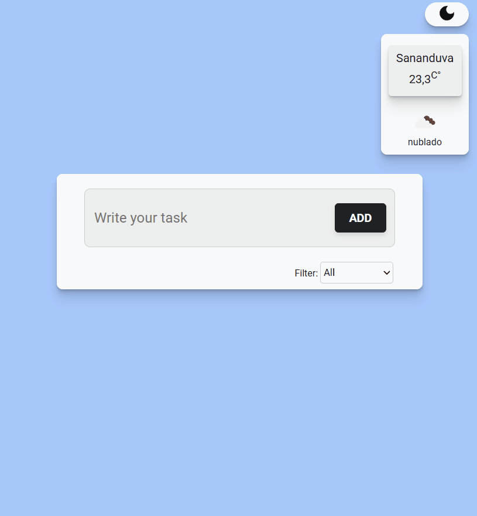

# To Do List + Clima em Tempo Real

Um projeto desenvolvido em React que vai além de uma simples lista de tarefas.  
Aqui você organiza seu dia enquanto acompanha a **temperatura atual baseada na sua localização**

---

## 📸 Preview

<p align="center">
  
</p>

---

## Funcionalidades

-> Adicionar tarefas  
-> Editar tarefas
-> Marcar tarefas como concluídas  
-> Remover tarefas  
-> Filtro de tarefas (todas / concluídas / pendentes)
-> Alternar entre modo **Light/Dark**  
-> Layout responsivo  
-> Exibição da **temperatura em tempo real** com base na localização do usuário  
-> Integração com API de clima  
-> Persistência de dados com LocalStorage (tarefas e tema)

---

## Tecnologias utilizadas

<p align="left">
  
  
  
  
</p>

---

## Como rodar o projeto

```bash
# Clone o repositório
git clone https://github.com/seu-usuario/seu-repo.git

# Acesse a pasta
cd seu-repo

# Instale as dependências
npm install

# Rode o projeto
npm run dev

```

---

## API utilizada

- OpenWeatherMap (dados de clima em tempo real)

---

## Aprendizados

Durante o desenvolvimento deste projeto, foram trabalhados conceitos importantes como:

- Componentização no React
- Gerenciamento de estado com `useState`
- Efeitos colaterais com `useEffect`
- Consumo de API externa
- Manipulação de eventos
- Responsividade e boas práticas de UI
- Estruturação de projeto front-end
- Persistência de estado com LocalStorage
- Manipulação e atualização de listas com `map`
- Controle de estado para edição de itens

---

## Versionamento de código

O projeto foi desenvolvido seguindo boas práticas de versionamento com Git, simulando um fluxo de trabalho profissional:

- Utilização de branches para desenvolvimento isolado de funcionalidades
- Merge controlado na branch principal (`main`)
- Commits semânticos para melhor rastreabilidade do código
- Histórico organizado facilitando manutenção e evolução do projeto

---

## Melhorias futuras

- Busca de clima por cidade (fallback caso a localização seja negada)
- Melhorias visuais e animações
- Notificações ou alertas para tarefas

---

## Autor

Feito com dedicação por **Gustavo Savi**

🔗 LinkedIn: https://www.linkedin.com/in/gustavo-savi
🔗 GitHub: https://github.com/gutosavi

---

## ⭐ Se você gostou do projeto

Deixe uma ⭐ no repositório — isso ajuda bastante!
